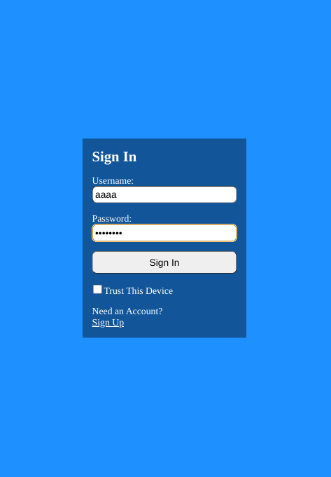
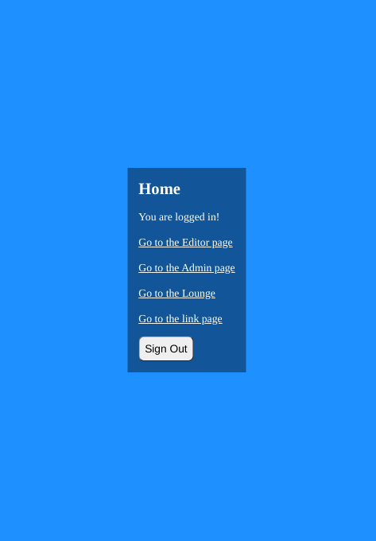
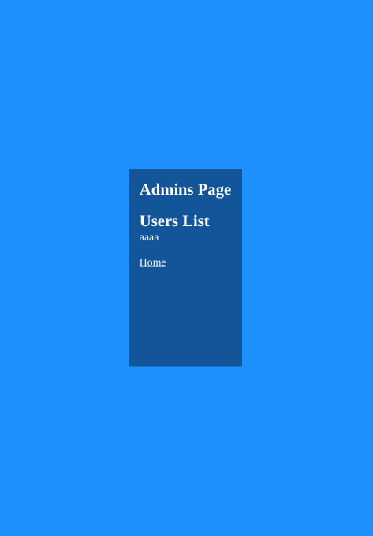
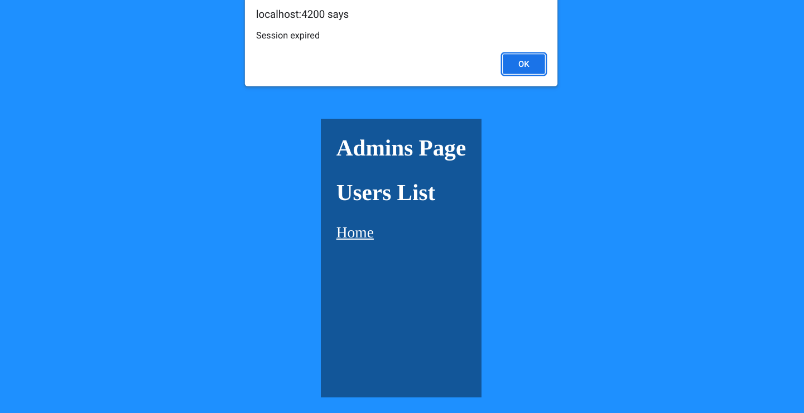
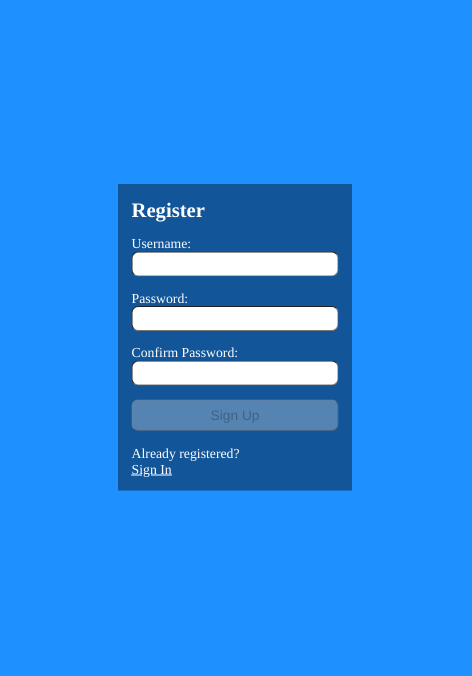
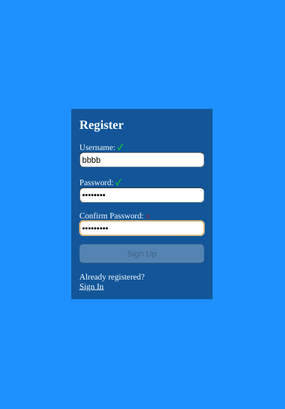
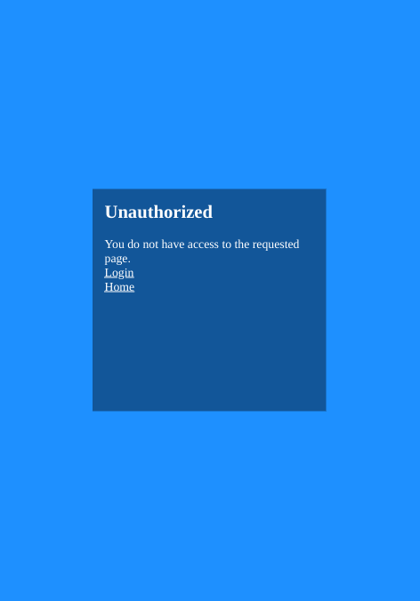

# Angular Register Tut

Angular conversion of this [repo](https://github.com/jdegand/react-register-tut).

## Screenshots



***



***


***



***


***


***



***



***



***


***


***



***

## Built With

- [Angular](https://angular.io)
- [Angular CLI](https://github.com/angular/angular-cli) version 15.2.5.

## How to Use

The Express application runs by default on `http://localhost:4000` and has the following endpoints:

 - `http://localhost:4000/register`
 - `http://localhost:4000/auth` 
 - `http://localhost:4000/users`
 - `http://localhost:4000/logout`
 - `http://localhost:4000/refresh`

### Running the Express Backend Application

You can clone my the whole [repo](https://github.com/jdegand/mongo-async-crud) and checkout to the angular branch or just clone the angular branch.  

```bash 

git clone https://github.com/jdegand/mongo-async-crud.git -b angular --single-branch

# cd into the directory
npm install

# Add .env with Mongo_URI Connection String, Token Secrets, & PORT

npm start
```
### Running the Angular Application

Run the express application first.  Use two terminals.  

```bash

git clone https://github.com/jdegand/angular-register-tut.git

# cd into the directory
npm install 

npm start
```

## Thoughts 

- Forget about using an async validator for username as users route is behind jwt verification
- Have to make a separate route for usernames or convert backend to use JWT middleware per route path 
- The persist cookie allows the refresh token to be called  
- If the persist cookie is not present, when the accessToken expires, there will be alert saying 'Session expired' and the user will be logged out 
- Refreshing the page still causes logouts
- Potential problems with not unsubscribing on some service calls
- Some CSS problems - the color scheme has poor contrast, the width of main div is variable and can look poor if content is minimal

## Useful Resources

- [Stack Overflow](https://stackoverflow.com/questions/42394999/why-should-i-use-validators-compose) - validators compose
- [YouTube](https://www.youtube.com/watch?v=Gt9odQS9w80) - confirm password validation in angular reactive forms | validations in angular 13 reactive form #24
- [YouTube](https://www.youtube.com/watch?v=NJfWx0OINhA) - PASSWORD CONFIRMATION IN ANGULAR | CUSTOM VALIDATION IN REACTIVE FORM
- [TG Clickography](https://tgclickography.com/blogs/angular/validate-password-match) - validate password match
- [Blog](https://www.joshmorony.com/username-availability-with-an-asynchronous-validator-in-angular/) - username availability with an asynchronous validator in angular
- [Bez Koder](https://www.bezkoder.com/angular-14-refresh-token/) - angular 14 refresh token
- [YouTube](https://www.youtube.com/watch?v=OG8vbzVuFoc) - Angular Login using Access & Refresh Tokens
- [YouTube](https://www.youtube.com/watch?v=nI8PYZNFtac&list=PL0Zuz27SZ-6PRCpm9clX0WiBEMB70FWwd&index=4) - Dave Gray
- [YouTube](https://www.youtube.com/watch?v=Yc93IvrouxY) - Angular Functional Guards - How to Use Functional Router Guards
- [Blog](https://itnext.io/angular-functional-router-guard-and-testing-with-inject-337d52b68f9c) - router guard and testing with inject
- [Stack Overflow](https://stackoverflow.com/questions/42719445/pass-parameter-into-route-guard) - pass parameter into route guard
- [Stack Overflow](https://stackoverflow.com/questions/75484659/angular-15-empty-activatedroute-params-in-functional-route-guards) - angular 15 empty activated router params in functional route guards
- [Danny Walls](https://www.danywalls.com/how-to-use-functional-router-guards-in-angular#heading-using-inject) - functional router guards
- [YouTube](https://www.youtube.com/watch?v=3IDkzcflvaU) - Angular Authentication part - 2 (Handling refresh token + Http Interceptor + .NET Core API) #28
- [Stack Overflow](https://stackoverflow.com/questions/9353630/check-if-httponly-cookie-exists-in-javascript) - check if http-only cookie exists
- [Dutch Lab](https://thedutchlab.com/blog/using-axios-interceptors-for-refreshing-your-api-token) - axios interceptors for refreshing your api token
- [Stack Overflow](https://stackoverflow.com/questions/60758154/how-to-check-if-jwt-token-is-expired-in-angular-8) - how to check if jwt token is expired 
- [Stack Overflow](https://stackoverflow.com/questions/68655492/throwerrorerror-is-now-deprecated-but-there-is-no-new-errorhttperrorresponse) - throwError deprecated
- [Stack Overflow](https://stackoverflow.com/questions/54380886/how-we-can-access-cookies-in-angular-6-without-ngx-cookie-service) - how we can access cookies in angular 
- [Stack Overflow](https://stackoverflow.com/questions/16010827/html5-localstorage-checking-if-a-key-exists) - localStorage checking if a key exists
- [Stack Overflow](https://stackoverflow.com/questions/16427636/check-if-localstorage-is-available) - check if localStorage is available
- [YouTube](https://www.youtube.com/watch?v=ahFEatzThIg) - 'subscribe' is deprecated. Instead of passing separate callback arguments, use an observer argument.